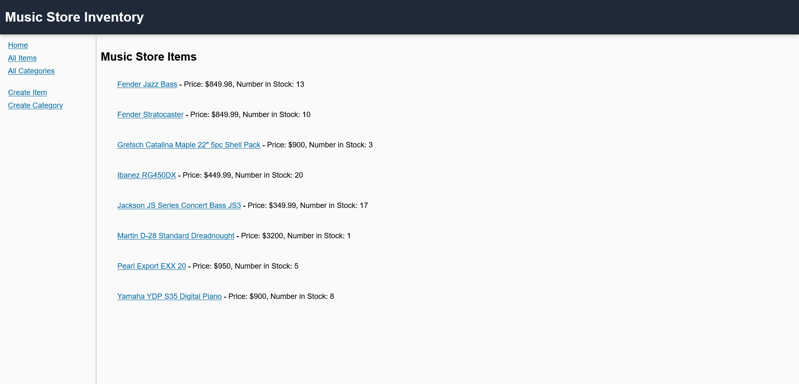

# Music Store Inventory App

This is a simple website that uses Node.js and server as an introduction to back-end web development.

While creating this project, I utilized MDN's [Express tutorial](https://developer.mozilla.org/en-US/docs/Learn/Server-side/Express_Nodejs/Tutorial_local_library_website) as the basis for a significant portion of the code. As this is a new topic for me, I am still not very used to many of back-end caveats just yet, but I am getting more confortable with it.

Once again, this is another project that is part of the [The Odin Project](https://www.theodinproject.com/) curriculum for Web Development. I chose to make this a music store mainly because it is one of my main hobbies. This project uses MongoDB and features all CRUD operations. You do need a password to make these operations however, but it is in the code. As this is mostly a back-end project, I didn't focus too much on CSS this time around, though I still made sure it looked good overall.